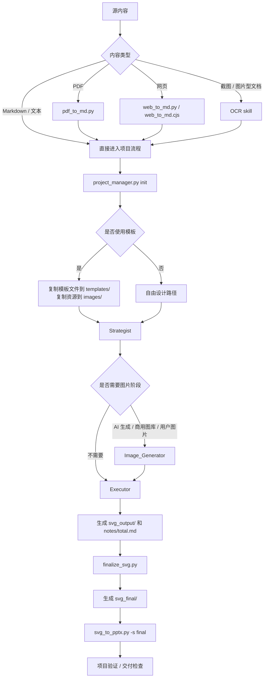

# PPT 工作流操作手册

> 适用对象：需要在本仓库中执行 PPT 生成、图片准备、SVG 后处理、PPTX 导出，或维护相关工作流文档与工具的使用者。

## 1. 手册目标

本手册用于回答四个最常见的问题：

1. 从哪里开始
2. 当前阶段应该用哪个角色 / 哪个命令
3. 什么情况下不能进入下一步
4. 如何降低 PPT 生成过程中的返工和失败率

如果你是第一次进入本工作流，建议阅读顺序：

1. 本手册
2. `../AGENTS.md`
3. `../roles/README.md`
4. `../commands/README.md`

---

## 2. 一图看懂完整流程



---

## 3. 30 秒启动指南

### 场景 A：用户给的是 PDF

```bash
python3 skills/ppt_master_workflow/commands/pdf_to_md.py <文件路径>
python3 skills/ppt_master_workflow/commands/project_manager.py init <项目名称> --format ppt169
```

然后进入：`Strategist -> Image_Generator（如需要）-> Executor -> finalize_svg.py -> svg_to_pptx.py -s final`

### 场景 B：用户给的是网页链接

普通网页：

```bash
python3 skills/ppt_master_workflow/commands/web_to_md.py <URL>
```

微信或高防站点：

```bash
node skills/ppt_master_workflow/commands/web_to_md.cjs <URL>
```

### 场景 C：用户给的是 Markdown

直接初始化项目并进入策略阶段：

```bash
python3 skills/ppt_master_workflow/commands/project_manager.py init <项目名称> --format ppt169
```

---
### 场景 D：用户给的是截图、扫描图片或图片型文档

此时不要直接进入 Strategist，应先使用仓库内 OCR skill 把图片内容转成 Markdown：

- 阅读 `.agent/skills/ocr_image_to_markdown/SKILL.md`
- 使用多模态查看图片内容
- 先整理出结构化 Markdown，再进入项目流程

完成 OCR 转录后，再执行：

```bash
python3 skills/ppt_master_workflow/commands/project_manager.py init <项目名称> --format ppt169
```

---

## 4. 阶段闸门表

| 阶段 | 进入前必须具备 | 当前阶段核心产物 | 未满足时禁止进入下一步 |
|------|----------------|------------------|------------------------|
| 阶段 0：前置检查 | 已阅读 `AGENTS.md` | 前置检查完成标记 | 不得切换角色 |
| 阶段 1：源内容处理 | 原始 PDF / URL / 图片型源内容 / Markdown | 标准化后的 Markdown 内容 | 不得开始策略设计 |
| 阶段 2：项目初始化 | 项目名称、画布格式 | 项目目录结构 | 不得写入 prompts / SVG / notes |
| 阶段 3：模板确认 | 是否使用模板已明确 | `templates/` 与 `images/` 已准备好 | Strategist 不得在模板缺失时开始 |
| 阶段 4：Strategist | 已有源内容与项目目录 | 《设计规范与内容大纲》 | Executor 不得凭空猜设计参数 |
| 阶段 5：Image_Generator | 图片清单明确 | `images/`、`images/stock/`、`images/image_prompts.md` | Executor 不得引用不存在的图片 |
| 阶段 6：Executor | 设计规范与图片路径明确 | `svg_output/`、`notes/total.md` | 不得直接交付 raw SVG |
| 阶段 7：后处理与导出 | 已有完整 SVG | `svg_final/`、`.pptx` | 不得从未后处理的 SVG 直接交付 |
| 阶段 8：优化 | 已有完整初稿 | 优化后的 SVG 与优化报告 | 不得用优化代替缺失的上游产物 |

---

## 5. 角色选择图

```text
你现在要做什么？
|
+-- 还没有设计规范 --------------------> Strategist
|
+-- 需要创建可复用模板 ----------------> Template_Designer
|
+-- 需要 AI 图片 / 商用图库 / 资产整理 --> Image_Generator
|
+-- 需要生成页面 SVG ------------------> 选择一个 Executor
|   |
|   +-- 通用灵活风格 ------------------> Executor_General
|   +-- 咨询风格 ----------------------> Executor_Consultant
|   +-- 顶级咨询风格 ------------------> Executor_Consultant_Top
|
+-- 初稿已有，只想优化页面质量 ---------> Optimizer_CRAP
```

---

## 6. 工具选择图

```text
当前最直接的任务是什么？
|
+-- 转换 PDF --------------------------> pdf_to_md.py
+-- 抓取网页 --------------------------> web_to_md.py / web_to_md.cjs
+-- 转录截图 / 图片型文档 --------------> OCR skill `.agent/skills/ocr_image_to_markdown/SKILL.md`
+-- 创建项目 --------------------------> project_manager.py init
+-- 验证项目 --------------------------> project_manager.py validate
+-- 生成 AI 图片 ----------------------> image_generate.py
+-- 验证图片 provider -----------------> smoke_test_image_provider.py
+-- 下载商用图库 ----------------------> download_stock_image.py
+-- 登记本地图库图片 ------------------> register_stock_image.py
+-- 后处理 SVG ------------------------> finalize_svg.py
+-- 导出 PPTX -------------------------> svg_to_pptx.py -s final
+-- 批量验证 / 质量诊断 ----------------> batch_validate.py / svg_quality_checker.py
```

---

## 7. 图片阶段可靠性规则

### 7.1 图片来源的标准路径

| 来源类型 | 标准落点 | 备注 |
|----------|----------|------|
| 用户提供图片 | `images/` | 如需分析比例，先运行 `analyze_images.py` |
| AI 生成图片 | `images/` | 统一通过 `image_generate.py` |
| 商用图库图片 | `images/stock/` | 必须登记到 `manifest.json` |
| 占位符 | 设计规范中显式标注 | 不得假装图片已就绪 |

### 7.2 图片阶段的禁止事项

- 不要先生成图片，再补写 `images/image_prompts.md`
- 不要把第三方图片热链直接写进最终 SVG
- 不要把 provider 冒烟测试跳过后就宣称配置可用
- 不要让 Executor 自己猜图或临时替换缺失图片

### 7.3 图片 provider 使用建议

- 默认 AI 生图入口：`image_generate.py`
- 需要验证 live provider：`smoke_test_image_provider.py`
- 需要稳定可商用实景图：优先走商用图库路径，而不是临时手工散落下载

---

## 8. 交付前检查清单

在声明任务完成前，至少检查以下内容：

- [ ] 源内容已转换完成，且策略依据的是最新内容
- [ ] 项目目录结构存在，且输出物都写在项目目录下
- [ ] 设计规范文件已生成
- [ ] 所有必要图片都在项目本地路径
- [ ] `svg_output/` 已完整生成
- [ ] `notes/total.md` 已生成
- [ ] 若尚未拆分逐页备注，导出前会自动从 `notes/total.md` 补齐
- [ ] 若导出依赖缺失，可先运行 `setup_export_env.py`
- [ ] 若需接自动化流水线，可使用 `project_manager.py doctor --json-output <file>` 导出预检结果
- [ ] `finalize_svg.py` 已执行
- [ ] `svg_to_pptx.py -s final` 已执行
- [ ] 已对最终 `.pptx` 做最基本的 spot check
- [ ] 已运行项目验证或等效检查

---

## 9. 最可靠的默认命令序列

```bash
# 1. 初始化项目
python3 skills/ppt_master_workflow/commands/project_manager.py init my_project --format ppt169

# 2. 如需验证图片 provider，先做 smoke test
python3 skills/ppt_master_workflow/commands/smoke_test_image_provider.py \
  --provider gemini \
  --output workspace/my_project/images

# 3. 执行角色产出，生成 svg_output/ 和 notes/total.md

# 4. 后处理
python3 skills/ppt_master_workflow/commands/finalize_svg.py workspace/my_project_ppt169_YYYYMMDD

# 5. 导出 PPTX
python3 skills/ppt_master_workflow/commands/svg_to_pptx.py workspace/my_project_ppt169_YYYYMMDD -s final

# 6. 验证项目
python3 skills/ppt_master_workflow/commands/project_manager.py validate workspace/my_project_ppt169_YYYYMMDD
```

---

## 10. 常见失败场景与回退路径

### 场景 0：用户给的是图片，但被当成普通文本源处理

回退方式：

1. 停止当前策略或执行阶段
2. 使用 OCR skill `.agent/skills/ocr_image_to_markdown/SKILL.md` 先把图片内容转成 Markdown
3. 确认 Markdown 结构可用后，再重新进入项目流程


### 场景 1：还没转 Markdown 就开始做策略

回退方式：

1. 停止策略阶段
2. 先执行源内容转换命令
3. 再重新进入 Strategist

### 场景 2：Executor 开始做页时图片还没准备好

回退方式：

1. 停止 Executor
2. 回到 Image_Generator
3. 确认所有图片已本地化后再继续

### 场景 3：直接从 `svg_output/` 导出

回退方式：

1. 先执行 `finalize_svg.py`
2. 使用 `svg_to_pptx.py -s final`
3. 重新检查导出结果

### 场景 4：provider 偶发失败，但被误判为“已稳定”

回退方式：

1. 用相同 provider / model / output 参数运行 `smoke_test_image_provider.py`
2. 确认凭证、网关、模型约束
3. 只有 smoke test 通过后，才把它视为稳定配置

### 场景 5：优化阶段被当成“补救上游问题”的替代品

回退方式：

1. 判断问题是视觉问题还是结构问题
2. 如果是结构、内容、图片缺失问题，回到上游角色处理
3. 只有在初稿完整时才进入 `Optimizer_CRAP`

---

## 11. 推荐阅读顺序

### 新人第一次上手

1. 本手册
2. `../AGENTS.md`
3. `../roles/README.md`
4. `../commands/README.md`
5. `./workflow_tutorial.md`
6. `./quick_reference.md`

### 只想快速执行一次完整流程

1. 本手册第 2、3、4、8、9 节
2. `../AGENTS.md` 的 Operational Quickstart
3. 对应角色文件的 quickstart 段落

### 只想排查问题

1. 本手册第 10 节
2. `../commands/README.md`
3. `../roles/*.md` 中的 Failure Recovery 段落

---

## 12. 相关入口

- 主流程总控：`../AGENTS.md`
- Skill 总入口：`../SKILL.md`
- 角色总入口：`../roles/README.md`
- 命令总入口：`../commands/README.md`
- 工作流 redirect：`../workflows/generate-ppt.md`
- 工作流教程：`./workflow_tutorial.md`
- 快速参考：`./quick_reference.md`
